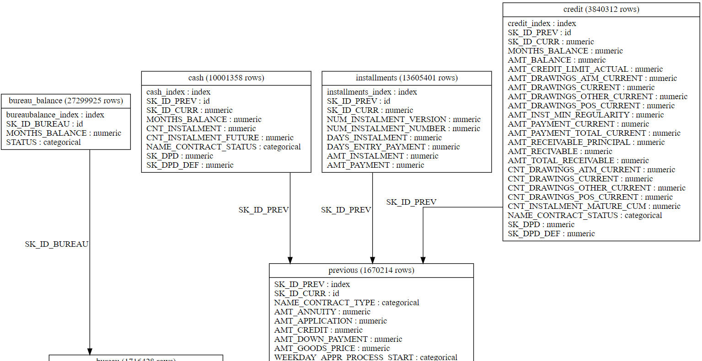

# default-risk-prediction

The Home Credit Default Risk competition is a *supervised classification task* where the objective is to *predict whether or not an applicant for a loan (known as a client) will default on the loan*. The description in `columns description.csv` describes the values the target takes as follows:

> "values 1 - client with payment difficulties: he/she had late payment more than X days on at least one of the first Y installments of the loan in our sample, 0 - all other cases".

None of what follows is affected by the shorter form of formulating the prediction task.

The data comprises socio-economic indicators for the clients, loan specific financial information, and comprehensive data on previous loans at Home Credit (the institution sponsoring the competition) and other credit agencies. 

The metric for this competition is *Receiver Operating Characteristic Area Under the Curve* (ROC AUC) with predictions made in terms of the probability of defaulting on the loan.

## Data description

The Home Credit Default Risk dataset consists of seven related tables of data:
|File name|Description|
|--|--|
|`application_train.csv`/`application_test.csv`|the main training/testing data for each client at Home Credit. The information includes both socioeconomic indicators for the client and loan-specific characteristics. Each loan has its own row and is uniquely identified by the feature `SK_ID_CURR`. The training application data comes with the `TARGET` indicating 0: the loan was repaid or 1: the loan was not repaid.|
|`bureau.csv`|data concerning client's previous credits from other financial institutions (not Home Credit). Each previous credit has its own row in bureau, but one client in the application data can have multiple previous credits. The previous credits are uniquely identified by the feature `SK_ID_BUREAU`.|
|`bureau_balance.csv`|monthly balance data about the credits in bureau. Each row has information for one month about a previous credit and a single previous credit can have multiple rows. This is linked backed to the bureau loan data by `SK_ID_BUREAU` (not unique in this dataframe).|
|`previous_application.csv`|previous applications for loans at Home Credit of clients who have loans in the application data. Each client in the application data can have multiple previous loans. Each previous application has one row in this dataframe and is uniquely identified by the feature `SK_ID_PREV`.|
|`POS_CASH_BALANCE.csv`|monthly data about previous point of sale or cash loans from the previous loan data. Each row is one month of a previous point of sale or cash loan, and a single previous loan can have many rows. This is linked backed to the previous loan data by `SK_ID_PREV` (not unique in this dataframe).|
|`credit_card_balance.csv`|monthly data about previous credit cards loans from the previous loan data. Each row is one month of a credit card balance, and a single credit card can have many rows. This is linked backed to the previous loan data by `SK_ID_PREV` (not unique in this dataframe).|
|`installments_payment.csv`|payment history for previous loans at Home Credit. There is one row for every made payment and one row for every missed payment. This is linked backed to the previous loan data by `SK_ID_PREV` (not unique in this dataframe).|

## Steps

1. [Exploratory Data Analysis](/notebooks/explanatory_data_analysis/)
2. [Feature Engineering](/notebooks/feature_engineering/)
3. [Modeling](/notebooks/modeling/)
4. [Feature Selection](/notebooks/feature_selection/)

## Aftermath

- The project has got us actually concerned about computational resources and the size of data for the first time. Our initial attempts of merging dataframes would result in kernel restarting because of using up all the RAM. By looking for a solution we have discovered Dask, which would only load a batch of data at the time. However, while we managed to merge to dataframes, attempts to save the resulting dataframes on either cloud or locally would result in system running out of RAM as well. We have managed to get over this problem by using a temporary dataframe (with unique ID values) which we would create for the sole purpose of storing only the relevant pieces of information that we would eventually add to the main dataframe. The problem that has must have been responsible was the fact that other tables had multiple entries inside the column that would be used as a joining column (as a single applicant could have had more than a single loan).

- The model that gave the best results (LGBM) has also turned out to be the model that was the quickest. It would have been an additional burden with respect to task such as search for the best hyperparameters or features to be selected if it was not the case.
